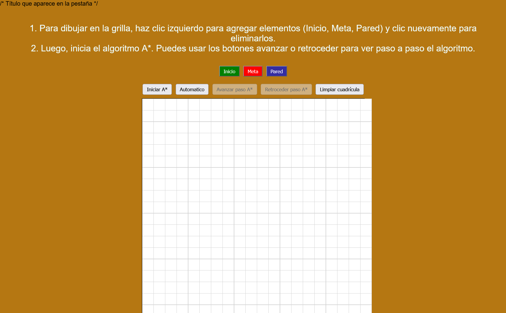

# Visualizador del Algoritmo A* (A-Star) / A* Algorithm Visualizer

Prueba la aplicación aquí: https://pintomultimedia2002.github.io/A_star_algorithm_Javascript/

---

## 🇪🇸 Versión en Español

### 📖 Descripción

Este proyecto es una aplicación web interactiva desarrollada para visualizar el funcionamiento del **Algoritmo de búsqueda A* (A-Star)**. A través de una interfaz gráfica basada en una cuadrícula, los usuarios pueden experimentar cómo este algoritmo encuentra el camino más corto entre un punto inicial y un punto final, evitando obstáculos.

Es una herramienta ideal para estudiantes y desarrolladores que deseen comprender la lógica detrás de los algoritmos de *pathfinding* y el uso de heurísticas.

### ✨ Características Principales

* **Cuadrícula Interactiva:** Tablero de 20x20 celdas.
* **Colocación de Elementos:** Inicio, Meta y Paredes (obstáculos).
* **Visualización en Tiempo Real:** Observa cómo el algoritmo explora los nodos.
* **Controles:** Iniciar búsqueda automática, avanzar paso a paso, o limpiar el tablero.
* **Cálculos Heurísticos:** Visualización de costos **F**, **G** y **H**.

### 🛠️ Tecnologías

* HTML5, CSS3, JavaScript (ES6+)

### 🚀 Cómo Usar

1. Abre el archivo `index.html` en tu navegador.
2. Selecciona "Inicio" y haz clic en la cuadrícula.
3. Selecciona "Meta" y haz clic en otro punto.
4. Selecciona "Pared" para dibujar obstáculos.
5. Haz clic en * *"Iniciar A* "**.

### 👥 Autores

* **David Pinto Gomez**
  * **LinkedIn:** [https://www.linkedin.com/in/pinto-gomez-david/](https://www.google.com/search?q=https://www.linkedin.com/in/pinto-gomez-david/)
  * **GitHub:** [https://github.com/pintomultimedia2002](https://www.google.com/search?q=https://github.com/pintomultimedia2002)
* **PaulaRR2000**
  * **GitHub:** [https://github.com/PaulaRR2000](https://github.com/PaulaRR2000)

---

## 🇺🇸 English Version

Test the program here: https://pintomultimedia2002.github.io/A_star_algorithm_Javascript/

### 📖 Description

This project is an interactive web application designed to visualize the  **A* (A-Star) Pathfinding Algorithm* *. Users can experiment with how the algorithm finds the shortest path between a start node and a goal node while avoiding obstacles on a grid.

### ✨ Key Features

* **Interactive Grid:** 20x20 cell board.
* **Element Placement:** Start, Goal, and Walls.
* **Real-Time Visualization:** Watch the algorithm explore nodes.
* **Controls:** Auto search, step-by-step, and clear grid.
* **Heuristics:** Visualization of **F**, **G**, and **H** costs.

### 🛠️ Technologies

* HTML5, CSS3, JavaScript (ES6+)

### 🚀 How to Use

1. Open `index.html` in your browser.
2. Select "Start" and click on the grid.
3. Select "Goal" and click on another spot.
4. Select "Wall" to draw obstacles.
5. Click * *"Start A* "**.

### 👥 Authors

* **David Pinto Gomez**
  * **LinkedIn:** [https://www.linkedin.com/in/pinto-gomez-david/](https://www.google.com/search?q=https://www.linkedin.com/in/pinto-gomez-david/)
  * **GitHub:** [https://github.com/pintomultimedia2002](https://www.google.com/search?q=https://github.com/pintomultimedia2002)
* **PaulaRR2000**
  * **GitHub:** [https://github.com/PaulaRR2000](https://github.com/PaulaRR2000)
